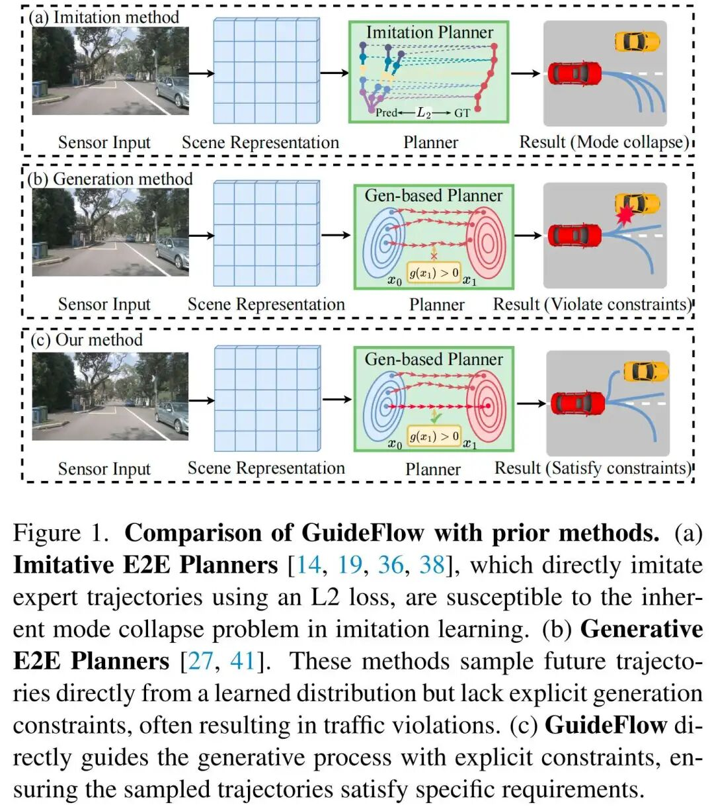
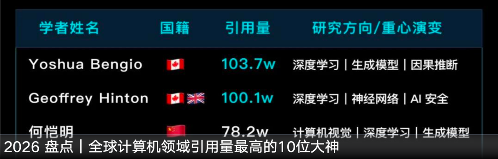
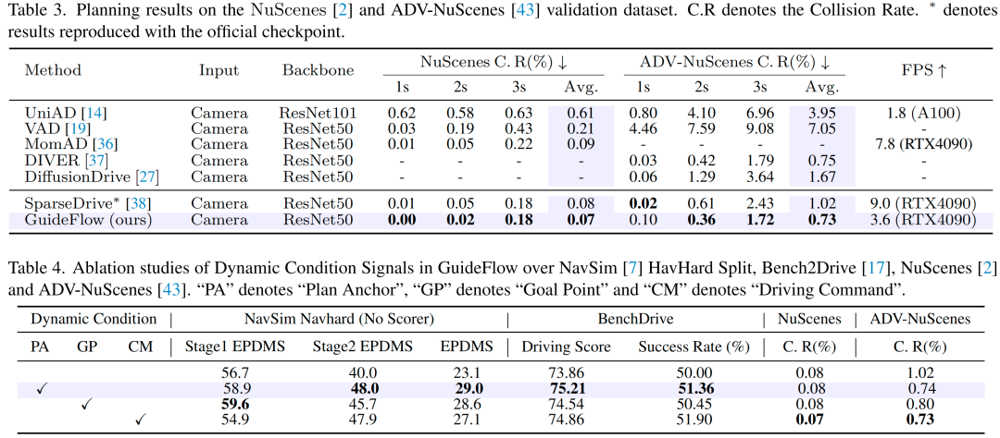

# GuideFlow 精读报告：约束引导的流匹配规划

> **论文标题：** GuideFlow: Constraint-Guided Flow Matching for Planning in End-to-End Autonomous Driving  
> **arXiv ID：** 2511.18729  
> **代码链接：** https://github.com/adeep-thu/GuideFlow  
> **来源：** 微信公众号「深蓝AI」深度解读（2026-04-27）  
> **精读整理：** 2026-04-27  
> **存放路径：** `/FM基础知识/Diffusion/`

---

## 一句话总结

GuideFlow 将「安全/规则/风格约束」嵌入 Flow Matching 生成动力学的三个层次（速度场CVF、流状态CF、能量RFE），实现端到端规划的「可控多模态生成」，在 NavSim/Bench2Drive/nuScenes 上取得 SOTA。

---

## 拟人化开篇

传统端到端规划系统里，规划头（planning head）本质上是一个「单点回归器」——给定当前场景表征 `s_t`，输出未来 T 个时刻的二维轨迹 `a_{t:t+T}`，训练目标是最小化与唯一 GT 轨迹的距离。

但真实驾驶不是单解问题。同一段感知输入，对应多种合理策略：保守跟车、轻微绕行、提前变道、稍后变道……真实条件分布是多峰的，而单模态回归只能逼近期望的「平均解」，这会带来两个致命问题：**多样性不足**（无法表达多模态策略）和**均值化失真**（平均轨迹反而可能更危险）。

于是生成式规划成为近一年自动驾驶最重要的趋势。但图像生成的随机性意味着创造力，而轨迹生成的随机性意味着越线、碰撞和不可执行。GuideFlow 的核心判断是：**多模态生成必须与显式约束建模一体化——约束不能只在终点做筛选，而应被嵌入生成动力学本身。**

---

## 背景与问题动机

### 2.1 为什么现有「多模态规划」其实是假的？

过去一年很多规划工作都强调 multi-modal planning，但大多数面临同样的典型困境：

- 训练范式还是 **IL（模仿学习）**
- 每个场景只有一条 GT
- 多模态输出只是结构上多了几个候选
- 实际训练后，大多数候选收缩到主模态附近

形式化来说：虽然模型名义上生成 K 条轨迹 `{a^k}`, 但在 IL 监督下，优化目标等价于让其中某一条尽量靠近唯一 GT：

```
min L = ||a^{k*} - a_{GT}||, 其中 k* = argmin_k ||a^k - a_{GT}||
```

结果是：只要某个模态更容易赢得监督，其他模态就逐渐失去学习动力，形成 **模式坍塌（mode collapse）**。

### 2.2 GuideFlow 的核心判断

GuideFlow 对这个问题的判断明确而清晰：

1. **分布生成**：轨迹应当通过分布生成而不是单点拟合来建模
2. **持续约束**：生成式规划不能只追求多样性，必须在采样过程中持续受物理与安全约束约束
3. **嵌入式约束**：「约束不能只在终点做筛选，而应被嵌入生成动力学本身」——这是 GuideFlow 和现有方法的关键分水岭

---

## 方法详解

### 3.1 为什么选择 Flow Matching 而不是 Diffusion？

当前生成式规划主要有两条路：**扩散模型**与**流匹配**。

**扩散模型**从噪声逐步去噪：p_θ(x_t | c) → p_θ(x_{t-1} | c)，擅长建模复杂多峰分布，但存在采样步数多、推理延迟大、约束难以自然作用到逐步去噪内部状态的问题。

**流匹配（Flow Matching）**直接学习一个连续向量场：

```
v_t(x | c) ：将简单先验分布 p_0 映射到目标轨迹分布 p_1
```

若采用 Rectified Flow，使用线性概率路径：

```
p_t(x) = (1 - t)·p_0 + t·p_1
```

对应监督目标：

```
L = ||v_θ(x_t, t | c) - (x_1 - x_0)||
```

对于规划任务，Flow Matching 有两个天然优势：

- **连续性强**：采样过程本身就有明显的轨迹演化解释
- **可干预性强**：既可以改速度场，也可以改中间流状态，还可以在能量层面改最终吸引子

这正好给 GuideFlow 的「约束嵌入式生成」提供了操作空间。

### 3.2 GuideFlow 条件生成框架

GuideFlow 写成如下条件生成过程：

```
a ~ p_θ(a | s_t, c_guidance)
```

其中：
- `s_t`：场景条件（BEV、agent tokens、map tokens）
- `c_guidance`：高层引导条件（anchor / goal / command / reward）

最终目标不是单纯采样到一条可行轨迹，而是采样到一个既**多样**、又**满足约束**的终态。

> **图 1：GuideFlow 条件生成框架**（对应论文 Fig.，展示从场景条件到约束引导的流匹配生成过程）
>
> 
>
> - 条件生成同时接受场景表征 s_t 和高层引导 c_guidance
> - 流匹配学习从噪声到轨迹的连续向量场 v_t
> - 采样结果同时满足多样性和安全约束

### 3.3 感知条件流生成器

GuideFlow 并不是在「真空」中生成轨迹，它首先基于多视角图像构建场景语义，再把这些语义变成条件速度场的上下文。

设 BEV 特征为 `F_bev`，动态体 token 为 `T_agent`，地图 token 为 `T_map`，轨迹流状态为 `x_t`，时间嵌入为 `pe(t)`。条件速度场为：

```
v_t(x | s_t) = MLP([x_t; F_bev; T_agent; T_map; pe(t)])
```

随后由 MLP 解码速度场得到轨迹更新。

> **图 2：场景感知条件流生成器架构**（对应论文 Fig.）
>
> 
>
> - **F_bev**：BEV 视角下的场景语义特征，编码道路拓扑与静态场景
> - **T_agent**：动态体 token，编码周围车辆/行人/障碍物的行为关系
> - **T_map**：地图 token，编码道路结构与车道约束
> - **x_t**：当前轨迹流状态，携带时间位置信息 pe(t)
> - MLP 将以上四类上下文融合，输出条件速度场 v_t

这一步的意义在于：GuideFlow 不是只看静态场景，而是显式利用了**动态交互信息**（周围车/人的行为关系）、**拓扑信息**（道路/车道/路口等结构约束）和**时间信息**（当前流状态在采样时间轴上的位置）。

### 3.4 Classifier-Free Intent Guidance

GuideFlow 把高层驾驶意图变成可以直接进入生成过程的**控制变量**，是实现「可控生成」的第二层机制。

论文主要使用四类条件：

| 条件类型 | 符号 | 说明 |
|---------|------|------|
| **规划锚点** (Plan Anchor) | `c_anchor` | 结构化轨迹先验，同时回答 where+how |
| **目标点** (Goal Point) | `c_goal` | 终点位置约束 |
| **驾驶指令** (Command) | `c_cmd` | 高级语义指令（车道保持/变道/左转/右转等） |
| **奖励/风格条件** | `c_reward` | 激进度/舒适性等风格控制 |

融合形式：

```
c = c_uncond + w·(c_cond - c_uncond)
```

其中训练时随机 mask 条件信号实现 classifier-free guidance。

在推理时，guidance 强度 `w` 决定了条件对生成方向的塑造强度：
- `w=0`：更自由，接近无条件生成
- `w→∞`：条件主导，但太大可能损害自然多样性

> **图 3：四类条件信号融合示意**（对应论文 Fig.）
>
> 
>
> - **Plan Anchor** 优于简单 command：command 只回答 where，anchor 同时回答 where + how，提供更强结构化先验
> - 推理时对每个锚点条件化采样：`a_k ~ p(a | anchor_k)`
> - 多样性不再靠噪声碰运气，而是有更强的结构支撑

### 3.5 三层约束机制（GuideFlow 最核心创新）

这是 GuideFlow 区别于所有其他方法的关键。三类约束分别进入「速度、状态、能量」三个层次：

#### 7.1 CVF：约束速度场（Constrained Velocity Field）

若从锚点或 scorer 选出一条满足约束的参考终点轨迹 `a_ref`，则参考速度场为：

```
v_ref = (a_ref - x_t) / (1 - t)
```

GuideFlow 对原始预测速度场 `v_θ` 做修正：

```
v_θ' = v_θ + α · proj_{constraint}(v_ref - v_θ)
```

如果当前速度方向与约束方向冲突，就把它往参考可行方向「折回去」。

几何解释：将速度分解到约束方向与正交方向，CVF 本质上在调节约束方向分量 `v_∥` 的符号与大小，减少「朝危险方向流」的分量。

**机理优势**：早期干预，防止轨迹一开始就走错方向；与 flow 形式天然兼容，修改的是动力学而不是结果。

**潜在代价**：每一步修得太强可能破坏概率路径平滑性；更像「连续纠偏」而不是「最小必要干预」。

#### 7.2 CF：约束流状态（Constrained Flow State）

把连续流离散化，记为 `x_{t_i}, i = 0...N`。

如果在某个阶段发现生成路径偏离了可行区域，最直接的办法是每一步都投影回可行集（太「硬」，严重破坏生成过程）。

GuideFlow 采用更柔和的方式：只在**中后期选一个关键时刻** `t_k`，用约束锚点替换中间状态：

```
x_{t_k}' = anchor_state
```

然后继续积分采样。

> CF 核心思想：**不是试图控制每一步，而是在最关键的时候做一次最小必要干预。**

从优化角度看，CF 近似「流形重定向」——让后续轨迹从一个更合理的状态继续往前流。相比 CVF，CF 更像「关键节点纠偏」，因此通常更不容易损害自然生成质量。

> **图 4：CVF vs CF 约束机制对比**（对应论文 Fig.，展示连续纠偏与关键时刻纠偏的区别）
>
> 
>
> - **CVF（左侧）**：每一步都对速度场做修正，连续纠偏，修改的是动力学方向
> - **CF（右侧）**：在关键时刻 t_k 做一次状态替换，直接将中间状态投影到可行流形上

#### 7.3 RFE：奖励/规则感知流能量优化（Reward/Rule-aware Flow Energy Optimization）

如果说 CVF 和 CF 还是在采样层做**外显干预**，RFE 更进一步：让模型在**训练时**就学会偏爱满足约束的区域。

GuideFlow 把流匹配的最后阶段 `t → 1` 解释为能量驱动优化阶段。将终端分布理解为：

```
p_∞(a) ∝ exp(-E(a))
```

低能量区域对应更容易被采样到的轨迹模式。若把约束评价器记为 `r(a)`，能量代理为：

```
E(a) ← E(a) + λ · max(0, r(a) - r_threshold)
```

训练目标中加入能量对齐项：

```
L_total = L_flow + λ · E[||∇_a log p_θ(a) + ∇_a E(a)||]
```

**核心思想转变**：约束不再只是一个**后验筛选器**，而成为了模型内部**能量地形的一部分**。

与单纯 scorer 的区别：
- **Scorer**：生成后评估 → 「生成后裁判」
- **RFE**：训练中塑形 → 「生成前教练」

RFE 在 OOD 场景更有潜力，因为规则和物理约束往往比具体数据样本更稳定、更可迁移。

### 3.6 统一视角：受约束的条件最优传输

从更高视角看，GuideFlow 实际上近似在求解一个**带约束的条件最优传输**问题：

**无约束时**，学习的是：
```
π* = argmin_π E_{π}[c(x_0, x_1)] 
```
使先验噪声分布映射到目标轨迹分布。

**加入约束后**，目标变为抵达约束可行分布：
```
π* = argmin_π E_{π}[c(x_0, x_1)]  subject to r(a) ≥ threshold
```

CVF/CF/RFE 各自扮演的角色：

| 模块 | 角色 |
|------|------|
| **CVF** | 局部修正传输方向 |
| **CF** | 局部修正传输路径上的中间状态 |
| **RFE** | 全局塑造目标分布的低能量结构 |

---

## 算法框架图

> **图 5：GuideFlow 整体算法框架**（对应论文结构框图 Fig.）
>
> 
>
> **数据流**：
> 1. 多视角图像 → BEV 编码器 → 场景表征 (F_bev, T_agent, T_map)
> 2. 场景表征 + 条件信号 (anchor/goal/command/reward) → 条件流匹配网络
> 3. 三层约束（CVF → CF → RFE）依次作用，修正轨迹生成
> 4. 输出：多样化、满足约束的轨迹候选

---

## 实验结果

### 11.1 NavSim NavHard：无 Scorer 仍具竞争力

| 配置 | EPDMS |
|------|-------|
| **无 scorer** | 27.1 |
| **有 scorer** | 43.0 |

说明：① GuideFlow 本身原始生成质量已经不差；② 在约束生成基础上加 scorer，能进一步释放多模态候选的价值。

### 11.2 Bench2Drive：安全约束不牺牲整体质量

| 指标 | 数值 |
|------|-------|
| **DS（Diversity Score）** | 75.21 |
| **SR（Success Rate）** | 51.36% |

关键洞察：**好的约束设计并不会自动把系统变成「更保守但更笨」的规划器**。如果约束以**内生方式**进入生成分布，反而可能同时提升安全性与整体闭环质量。

### 11.3 nuScenes / ADV-nuScenes：生成式不等于更危险

> **图 6：nuScenes 对比结果**（对应论文 Table/Figure）
>
> 在开环与对抗场景上，GuideFlow 的碰撞率更低。
>
> **核心结论**：生成式方法不是天然不安全。真正决定安全性的，是你是否把约束写进了生成机制，而不是只在结果末端做筛选。

### 11.4 条件与约束消融：三类约束互补

| 消融项 | 结论 |
|--------|------|
| Plan Anchor > command / goal point | 结构化轨迹先验比语义指令更强 |
| CF > CVF | 关键节点纠偏优于全程高频干预 |
| RFE 对 OOD 提升更明显 | 能量塑形比纯后验打分更具泛化潜力 |
| **CF + RFE 组合最优** | 互补机制叠加效果最好 |

---

## KnowHow + 总结评价

### GuideFlow 推动的三件事

1. **把规划从「单点预测」推进到「受约束分布生成」**：未来规划器不再只是回归一个答案，而是生成一组站得住的答案

2. **把安全从「后处理规则」推进到「生成动力学的一部分」**：安全不再只靠外部模块兜底，而是逐步成为模型内部偏好

3. **把驾驶风格从「隐式副产物」推进到「可控变量」**：规划器将更像一个可调的策略生成器

### 局限与未解决问题

1. **采样效率仍是现实问题**：采样加速会带来性能下降。flow matching 虽然比 diffusion 更高效，但高强度实时部署仍需 reflow、mean flow 或更强的一步式蒸馏

2. **当前约束偏向「安全/合规/风格」，更复杂的社会性交互（礼让与博弈、不确定预判、长时程通行效率、乘坐舒适性）仍待建模

3. **仍主要是轨迹层生成，尚未完全扩展到长时程 latent world planning**

### 个人点评

GuideFlow 的价值不只是又做了一个新的 planning head，而是在回答一个更清晰的范式问题：

> **「下一代端到端自动驾驶规划器，应该怎样把「多样性、约束与可控性」统一起来？」**

自动驾驶规划的未来，不是更自由地生成，而是更受约束地生成。

---

## REFERENCE

- **GuideFlow**: *Constraint-Guided Flow Matching for Planning in End-to-End Autonomous Driving*, arXiv:2511.18729
- **代码**: https://github.com/adeep-thu/GuideFlow
