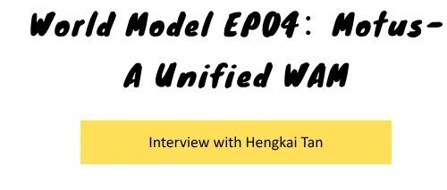
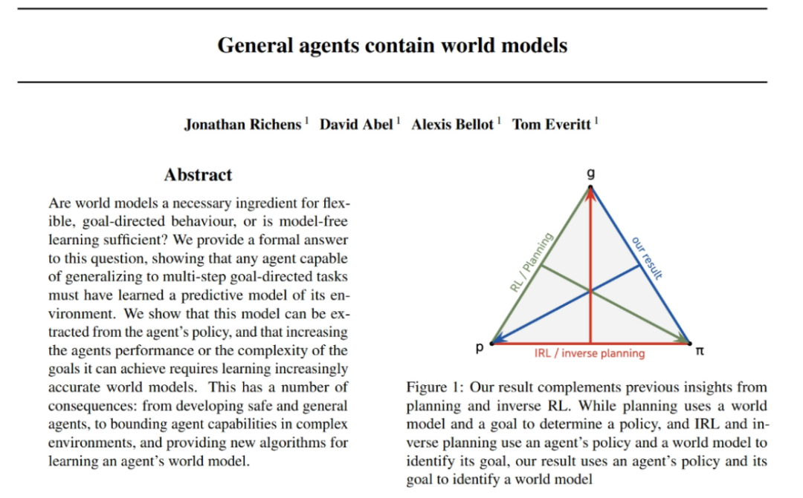

# 世界模型 EP04：Motus

> 来源：石麻笔记（微信公众号）  
> 嘉宾：谭恒楷博士（Motus 工作参与者）  
> 原文链接：https://mp.weixin.qq.com/s/hAlnB--SjURS7ukY4gO_Kw  
> 项目主页：https://motus-robotics.github.io/motus

---

## 一、为什么 Motus 当初叫 Latent Action World Model？

Motus 工作发表于 2024 年，当时还没有 "World Action Model" 这个概念（英伟达于 2025 年 1-2 月才提出），所以团队从两个初衷出发：

1. **Unified World Model**：做一个统一的、能处理多种模态数据的 world model
2. **Latent Action**：引入 latent action 来统一不同来源的动作信号

核心目标是**充分利用各种多模态异构数据**——互联网视频、图文数据、机器人轨迹数据、任务无关轨迹数据等。不同模态都可以被纳入，而不是局限在某种特定数据形式上。

这与 AI 发展的规律一致：颠覆式突破往往来自于找到一种新范式，可以吞下超大规模数据。从 AlexNet 到 GPT，再到视频模型，都是在"可吞下的数据范围"方面有了跳跃式突破。

> Google DeepMind 2025 年 6 月发表的论文 *General Agents Contain World Models* 证明了：目标（Goal）、dynamics model（世界模型）、policy 三者有任意两者都可以推出第三个，因此建模世界模型和建模 policy 之间是互通的。

---

## 二、Motus 和当下 VLA 以及 WM 的区别

可以按九宫格来理解四种不同的建模方向：



其中：
- **o₀**：当前 observation（当前帧）
- **o₁ 到 oₖ**：未来要预测的帧
- **a₁ 到 aₖ**：未来的 action
- **O / S**：Observation（2D Video）
- **a**：Action
- **Q (Query)**：我想找什么信息（被预测的）
- **K (Key) / V (Value)**：信息的索引 / 信息内容
- **Attention**：Query 根据 Key 的匹配程度从 Value 读取信息

四种象限分别对应：

| 象限 | 模型 | 建模关系 | 本质 |
|------|------|----------|------|
| VGM | Video Generation Model | Video → Future Video | 学习视觉世界的动态规律 |
| IDM | Inverse Dynamics Model | Future Video → Future Action | 从结果反推动作，将视觉变化转化为控制动作 |
| WM | World Model | Action → Future Video | 经典 dynamics model，单向流 |
| VLA | Vision Language Action | Video + Action → Future Action | 从观测直接预测动作，不预测视频 |

### VLA 的局限

VLA 本质上是**单向的**，从 observation 预测 action，没有双向联合建模，也没有把视频预测纳入进来，因此无法通过 video prediction "吞"视频数据。

### Unified WM 的优势

Unified World Model / World Action Model 把这四个方向**全部放在一起建模**：

- video → video（视频生成）
- video → action（IDM，逆动力学）
- action → video（World Model）
- action → action（VLA，action 自注意）

不同类型的数据（纯视频数据、无任务条件数据、机器人轨迹数据）都可以统一纳入框架训练。本质上是建模**联合分布**，从而实现多模态信息的**双向交互**。


---

## 三、Unified World Model 和传统 World Model 的区别

传统定义的 world model 本质上是一个 **transition function**：

$$p(o_{t+1} | o_t, a_t)$$

即给定当前状态和动作，预测下一状态——这只是**其中一个条件分布**（action → observation 这条单向流）。

Unified World Model 同时在建模**多种关系/概率分布**：

- $p(o_{t+k} | o_t)$ — VGM（视频生成）
- $p(a_{t+k} | o_t, o_{t+k})$ — IDM（逆动力学）
- $p(a_{t+k} | o_t, a_t)$ — Policy / VLA
- $p(o_{t+1} | o_t, a_t)$ — 传统 WM（dynamics）

因此 Unified WM 是一个**更 general 的联合建模框架**，传统 WM 只是其中的一个子集。

---

## 四、不同路径怎么走到机器人 Policy？

目前有三条不同的"信息流"路径将 video 能力传到 policy 上：

### 路径 1：IDM 路线
```
VGM → IDM → Action Policy
```
代表工作：UniPi、RoboDreamer、Vidar、Gen2Act、Lingbot-va

先做视频预测，再通过逆动力学（IDM）从视频中反推出 action。

### 路径 2：World Model 路线
```
WM → RL → Action Policy
```
所有做原始定义 world model 的团队都想用 WM 来增强 Policy。

先学好 dynamics，然后在 world model 里做 RL 或 planning。

### 路径 3：Unified / 两边一起流
```
Video ↔ Action 联合建模 → Policy
```
Motus 和 World Action Model 走的是这条路线，同时建模 video 和 action，让两边的信息一起流动，直接学一个联合模型。

---

## 五、Motus 训练框架

### 理想 vs 现实

**理想**：做一个"多 expert"的统一模型，将视频生成 expert、action expert、understanding expert 全部放在一起，通过 joint attention 做交互。一次训练同时完成 IDM、world model、VLA、视频生成等所有任务。

**现实**：直接全部一起训练容易把视频模型已学到的能力"训坏"。实际做了工程上的 trade-off：

1. **第一阶段**：只训练视频生成
2. **第二阶段**：freeze 视频部分，训练 action 和 understanding
3. **第三阶段**：SFT

### 框架核心设计

- **Unified 框架**：使用类似 Unidiffuser 的框架，通过控制各 expert 的 diffusion timestep，在同一个模型里切换不同推理模式
- **Understanding Expert**：接了一个 VLM（如 Qwen）的 feature，带有较强语义信息
- **Joint Attention**：每个 expert 在每一层都和其他 expert 做 joint attention，实现信息融合

**核心优势**：
1. 可以吃进更多不同来源的数据
2. 可以利用已有的预训练基座（视频模型、VLM 等）
3. 把不同任务模式统一起来

框架本身可以不断扩展——加更多模态（如音频、触觉），本质就是往里加 expert 模块（DiT 或 Transformer）。

### Unidiffuser 的作用

Unidiffuser 在最后一层起作用。本质上是一个 **DiT 结构**，通过 diffusion 的 timestep 来控制去噪过程，从而实现不同模式之间的统一和切换。

---

## 六、Motus 训练数据

### 数据金字塔（六层）



| 层级 | 数据类型 | 规模 |
|------|----------|------|
| L6（顶层）| Target 本体数据 | 最小，最精细干净，需人工采集 |
| L5 | 多本体数据 | 较小 |
| L4 | 任务无关数据 | 中等，可自动化生成 |
| L3 | 模拟器数据 | 中等，有 gap，辅助作用 |
| L2 | Egocentric 数据 | 较大，百万小时级 |
| L1（底层）| 互联网视频 | 最大，十亿小时级 |

### 各阶段注入策略

- **Stage 1（视频模型训练）**：主要用视频数据（互联网视频、带任务视频）。不一开始就注入 target 数据，避免污染后续测试/微调
- **Stage 2（联合训练）**：逐步引入更贴近任务的数据，融合不同模块
- **Stage 3（SFT）**：target 本体和目标任务数据

### Latent Action 的作用

引入 latent action 的原因：
1. 很多数据本身**没有 action label**，或信号弱、噪声大
2. 不同机器人本体的 **action space 不一致**

解决方案：用统一的潜在表示（latent action）去对齐不同来源的动作信息，同时也为 action expert 提供更好的初始化先验。

### 实际训练规模

- 约 **200 万条**数据
- **20 台机器**
- 每个 stage 约 **1 周**，三个 stage 共约 **2 周多**

---

## 七、不同层级数据量的需求

| 层级 | 数据规模 |
|------|----------|
| 互联网视频 | **数十亿小时** |
| Egocentric 数据 | **百万小时级** |
| 多本体数据 | **万小时级** |
| 视频生成模型（听说）| 已接近**上亿小时** |

### Egocentric 数据视角问题

头部视角（first-person）是更符合"第一性原理"的数据形式——人主要通过头部视觉完成感知和决策。但当前模型能力有限，腕部相机可以补充视角、解决遮挡和细粒度问题。

短期内更现实的方式是"兼容"——Motus 框架本身就支持多模态输入，多个相机、多个视角都可以接入一起用。

---

## 八、后训练阶段

Fine-tune 阶段是**所有模式一起做联合训练**的：

- 视频生成、IDM、world model、VLA 四种模式都包含在训练中
- Video 和 action 之间是**双向交互**，不只是单向依赖，而是相互 condition、相互影响
- 推理时可以做**联合推理**——video 和 action 同时生成，两者的 diffusion timestep **同步去噪**

---

## 九、Next Token Prediction 到 Next State Prediction 的本质区别

### 语言模型 vs 机器人/WM

- **语言模型**：next token prediction，token 是**离散**的，用 cross entropy 建模很自然
- **机器人/WM**：action 和视频本质上是**连续**的，强行离散化会带来明显信息损失

### 当前主流方案：AR + Diffusion 组合

在**时间维度上是自回归（AR）**，在**每一帧/状态内部是用 diffusion 建模连续分布**：

```
时间：AR（自回归），一帧一帧或一个 chunk 一个 chunk 往后推
空间：Diffusion（连续分布建模）
```

这基本已经是共识。Genie3 等工作也是类似思路。

### 三种路线汇总

| 路线 | 代表 | 信息流 |
|------|------|--------|
| Unified / WAM | Motus | Video ↔ Action 双向建模 |
| Action-conditioned WM | 传统 WM 团队 | WM → RL → Policy |
| Video → IDM → Policy | UniPi、Vidar | Video → IDM → Policy |

---

## 十、为什么中国这么多世界模型相关的创业公司？

### 视频模型领域中国整体较强

Sora 之后，实际效果和后续发展并没有完全拉开差距，反而从榜单和实际产品看，很多领先模型都是中国团队在做。尤其是世界模型 + 具身智能结合这块，国内创业公司数量明显比美国多。

### 原因分析

**微观原因**：中国积累的视频数据优势更大，美国视频数据存在合规性问题。

**宏观原因**："人变了"。做语言模型的主力是 90 年代出生的人；但现在做视频模型的主力是 95 后，甚至 00 后。这一代人整体教育背景、技术能力相比之前有明显提升，而且**在中国的提升幅度大于美国同一代人**。

叠加国内更活跃的创业环境，视频模型在商业化和落地上开始有反超趋势。

---

## 十一、和 Interactive World Simulator 等工作的思想对比

### 核心区别：建模视角

- **传统思路**：先把一条路径做到极致，再逐步扩展
- **Motus 思路**：从更抽象的角度，事物是普遍联系的——video 和 action 本质上紧密耦合，是**双向交互**的关系

### 概率建模视角

只建模一个条件分布（如传统 WM 的 transition），只覆盖系统的一部分。建模更完整的**联合分布**，同时覆盖边缘分布、条件分布，能捕捉更全面的信息，更容易覆盖长尾和复杂情况。

本质上，所有 AI 模型都在做概率分布建模——语言模型的 next token prediction、视频生成、world model，本质都一样。

### Data Scaling 的有趣发现

**常规 scaling 曲线**：与 π0.5 对比，data efficiency 有 **2.6 倍到 13 倍**的提升。

**多任务 scaling 的有趣现象**：

| | 1 任务 | 50 任务 |
|--|--------|--------|
| π0.5 | ~70% | **下降**到 ~50%（任务间互相干扰） |
| Motus | 类似起始水平 | **提升**到接近 90% |

Motus 任务越多平均成功率越高，说明模型在学习一种 **"world knowledge"**（任务间共享知识），而不是孤立地学每个任务。

> 评测是在类似模拟器的 benchmark 上完成的，50 个任务设置。

---

## 参考链接

| 资源 | 链接 |
|------|------|
| **项目主页** | https://motus-robotics.github.io/motus |
