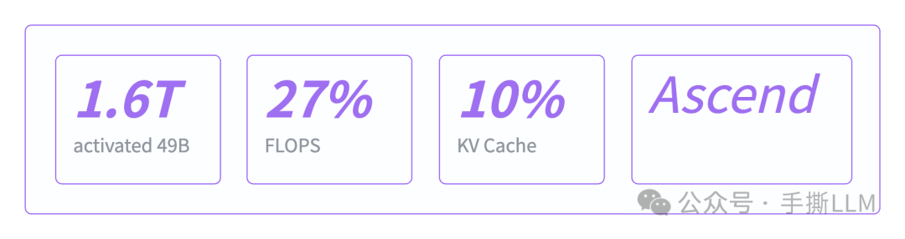
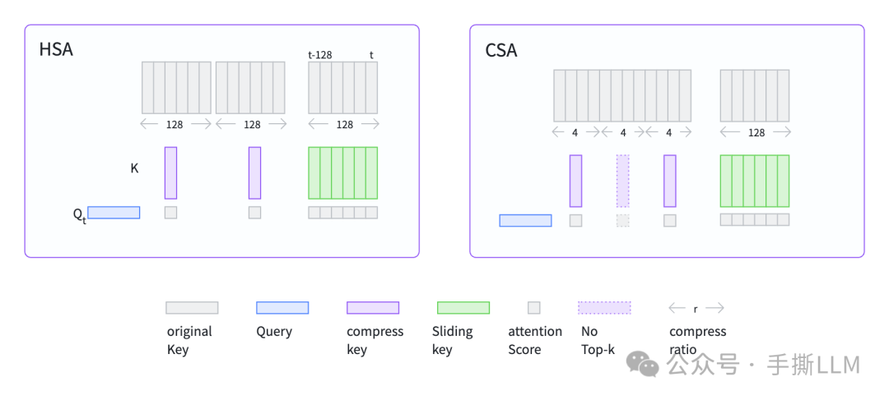
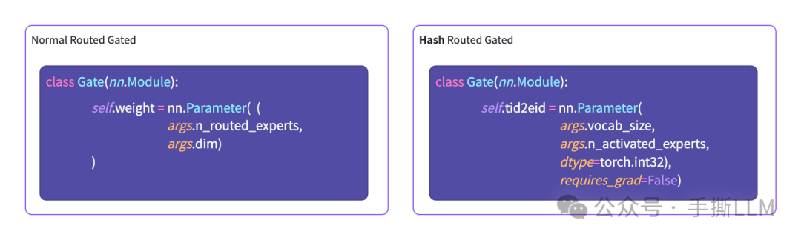
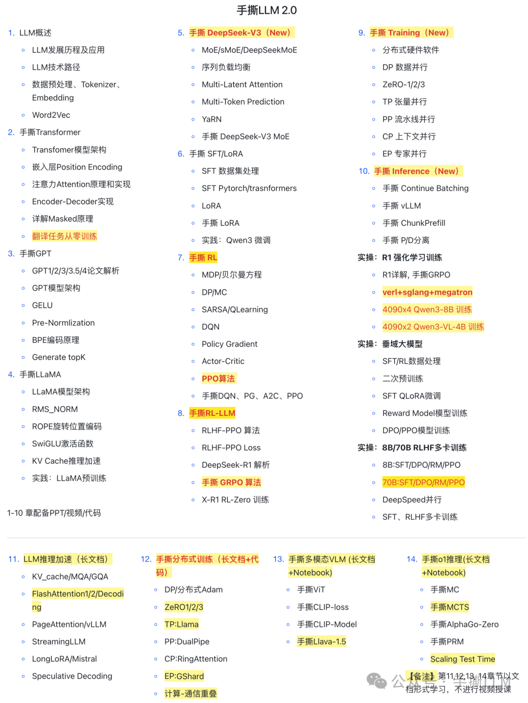

# 手撕 DeepSeek-V4 (1) : 模型架构

> **来源：** 微信公众号「小冬瓜AIGC」  
> **原文链接：** https://mp.weixin.qq.com/s/k-4O9YnIkQXwDVPTa3T7aA  
> **发布时间：** 2026-04-27 08:03（广东）  
> **系列：** 手撕 DeepSeek-V4（共多篇）  
> **抓取时间：** 2026-04-27

---

## 一句话总结

DeepSeek-V4 模型架构逐层拆解：HCA/CSA/SWA 三种 KV 压缩策略、Hash-Route MoE、mHC 连接方式，配以精简 PyTorch 骨架代码。

---

## 前言

本系列将连载 V4 从模型架构到 Infra 优化的细节，并为相关技术提供 PyTorch 级别代码。

**代码仓库：** github.com/dhcode-cpp/DeepSeek-V4-mini

---

## 1. 总览

DeepSeek-V4 发布，主打**百万(1B) 长度长上下文能力**，算法与工程创新齐飞。V4 Pro 关键参数：

| 指标 | 数值 |
|------|------|
| 总参数 | **1.6T**（激活 49B） |
| 1B context 下单 token FLOPS | 仅需原来的 **27%** |
| KV-Cache | 仅需原来的 **10%** |
| 适配硬件 | 国产 **Ascend** 架构 |

> **图 1：DeepSeek-V4 核心指标概览**
>
> 
>
> - **左表**：V4 Pro 关键参数，总参 1.6T / 激活 49B
> - **右表**：1B context 下 FLOPS 降至 27%，KV-Cache 降至 10%，适配 Ascend 架构

---

## 2. DeepSeek-V4 架构

本文基于官方论文 *DeepSeek-V4: Towards Highly Efficient Million-Token Context Intelligence*，自顶向下逐层讲解。以 **V4-Pro** 配置为主。

### 2.1 Block 分布

- 共 **61 个 Block**：前 2 层注意力为 HCA，之后 CSA 与 HCA 交替，最后一层不使用 CSA/HCA
- 前 3 个 Block 的 MoE 采用 **Hash-Route**，整体与 V3 sMoE 略有改动
- 采用 **mHC** 连接方式，并在解码器输出中与 Norm 融合来汇总多分支

V4-Pro 官方配置 `compress_ratios`：

```
compress_ratios: [128, 128, 4, 128, 4, 128, 4, 128, 4, 128, 4, 128, 4, 128, 4, 128, 4, 128, 4, 128, 4, 128, 4, 128, 4, 128, 4, 128, 4, 128, 4, 128, 4, 128, 4, 128, 4, 128, 4, 128, 4, 128, 4, 128, 4, 128, 4, 128, 4, 128, 4, 128, 4, 128, 4, 128, 4, 128, 4, 128, 0]
```

含义：
```python
# Attn Type
# 0: MQA
# 4: CSA
# 128: HCA
```

> **图 2：Block 类型分布配置（对应论文 Table）**
>
> 
>
> - compress_ratios 数组从 index 2 起交替出现 4（CSA）和 128（HCA），共 61 层
> - 最后一位为 0，表示最后一层退化为 MQA（不做 KV 压缩）
> - 前 2 层直接是 HCA（128），体现 Heavy Compression 从浅层就开始

---

### 2.2 Attention

V4 中主要包含**三种 KV 筛选方式**：

| 方式 | 全称 | 压缩比 | 说明 |
|------|------|--------|------|
| **HCA** | Heavily Compressed Attention | **128** | 沿 context 维度大幅压缩 KV |
| **CSA** | Compressed Sparse Attention | **4** | 先轻量压缩，再通过旁路 Indexer 稀疏 Top-K 选取 |
| **SWA** | Sliding Window Attention | 就近窗口 | 作为 HCA/CSA 的伴随机制 |

得到 QKV 后，均用 **MQA** 进行计算。HCA/CSA 由 Attention 类统一控制：

```python
class Attention(nn.Module):
    def __init__(self, layer_id: int, args: ModelArgs):
        super().__init__()
        self.layer_id = layer_id
        self.dim = args.dim
        self.compress_ratio = args.compress_ratios[layer_id]

        if self.compress_ratio:
            self.compressor = Compressor(args, self.compress_ratio, self.head_dim)
            if self.compress_ratio == 4:
                # 4 is CSA
                self.layer_cls = "CSA"
                self.indexer = Indexer(args, self.compress_ratio)
            else:
                # 128
                self.layer_cls = "HCA"
                self.indexer = None
        else:
            # compress_ration = 0
            self.layer_cls = "MQA"
```

> **图 3：HCA / CSA / SWA 三种 KV 筛选机制对比**
>
> 
>
> - **HCA**（左侧）：沿 context 维度做 128x 强压缩，大幅削减 KV Cache 显存
> - **CSA**（中间）：先 4x 轻量压缩，再通过旁路 Indexer 稀疏选取 Top-K，兼顾压缩率与信息保留
> - **SWA**（右侧）：就近滑动窗口，作为 HCA/CSA 的补充伴随机制
> - 三者共享 MQA 输出层，统一通过 QKV → MQA 计算

---

### 2.3 MoE

前 3 个 Block 使用**哈希路由 MoE**，特点：

- 专家选择由**哈希函数确定，完全确定性**
- 相关参数**无需更新**
- Token 根据其 ID **固定路由**到对应专家

> **图 4：Hash-Route MoE 架构**
>
> 
>
> - Token 输入的 `input_ids` 直接经哈希函数映射到固定的 `tid2eid` 专家索引
> - 无需可学习的 Gate 网络，避免负载均衡问题
> - 前 3 层 MoE 使用 HASH 路由，后续层切换为可学习的 TOPK 路由

Gate 前向逻辑：

```python
class Gate(nn.Module):
    def __init__(self, layer_id: int, args: ModelArgs):
        # ...

    def forward(self, x, input_ids):
        scores = linear(x.float(), self.weight.float())
        # ...
        if self.hash:
            indices = self.tid2eid[input_ids]
        else:
            indices = scores.topk(self.topk, dim=-1)[1]
        # ...
```

---

### 2.4 mHC

关于 mHC（Multi-Head Connection），详见：[mHC 详解](https://zhuanlan.zhihu.com/p/1990683672337223894)

在 V4 中的实现：

- 输入通过 `torch.repeat()` 将 `[B,L,D]` 扩展为 `[B,L,N,D]`
- 解码器输出为 `[B,L,N,D]`，融合多分支时与 RMSNorm 融合处理

```python
class Transformer(nn.Module):
    def __init__(self, args: ModelArgs):
        super().__init__()
        # ...
        self.norm = RMSNorm(args.dim, self.norm_eps)
        self.head = LMHeadWithHC(args.vocab_size, args.dim)

    @torch.inference_mode()
    def forward(self, input_ids: torch.Tensor, start_pos: int = 0):
        h = self.embed(input_ids)
        # HC expand
        h = h.unsqueeze(2).repeat(1, 1, self.hc_mult, 1)
        # blocks
        for layer in self.layers:
            h = layer(h, start_pos, input_ids)
        # HC merge + rms_norm + lm_head proj
        logits = self.head(h, self.norm)
        return logits
```

---

## 3. V4 架构简化

参考官方代码，去除数据类型与计算细节，将约 800 行代码精简至 **200 行**，保留核心骨架。

**代码仓库：** github.com/dhcode-cpp/DeepSeek-V4-mini

层类型示例：

```python
# 0:MQA, 4:CSA, 128: HCA
compress_ratios = [0, 0, 4, 128, 4, 128, 4, 0]
```

运行 `python ./lc1/model_simple.py`，输出：

```
> block.0 attn type: MQA
> block.0 moe type: HASH
---------------------------
> block.1 attn type: MQA
> block.1 moe type: HASH
---------------------------
> block.2 attn type: CSA
> block.2 moe type: TOPK
---------------------------
> block.3 attn type: HCA
> block.3 moe type: TOPK
---------------------------
> block.4 attn type: CSA
> block.4 moe type: TOPK
---------------------------
> block.5 attn type: HCA
> block.5 moe type: TOPK
---------------------------
> block.6 attn type: CSA
> block.6 moe type: TOPK
---------------------------
> block.7 attn type: MQA
> block.7 moe type: TOPK
---------------------------
input shape: torch.Size([2, 128])
output logits shape: torch.Size([2, 128, 100])
```

> **图 5：精简代码运行输出与 Block 类型分布**
>
> 
>
> - 可见前 2 层（block.0 / block.1）：MQA + HASH 路由 → 对应前 2 层注意力配置为 MQA、MoE 为 Hash-Route
> - block.2：首次出现 CSA + TOPK → 对应 compress_ratio=4
> - block.3：HCA + TOPK → 对应 compress_ratio=128
> - 后续 CSA 与 HCA 交替，最后 block.7 退化为 MQA（无压缩）

---

## 4. 总结

1. 梳理了 DeepSeek-V4 的整体网络结构
2. 提供了精简的架构代码，聚焦模块输入输出与数据流，剥离 HCA/CSA/mHC 的复杂计算细节

---

## 5. 扩展阅读

- **NSA:** https://zhuanlan.zhihu.com/p/24841366485
- **DSA:** https://zhuanlan.zhihu.com/p/1957032283270812718
- **mHC:** https://zhuanlan.zhihu.com/p/1990683672337223894

---

## REFERENCE

DeepSeek-V4: Towards Highly Efficient Million-Token Context Intelligence
